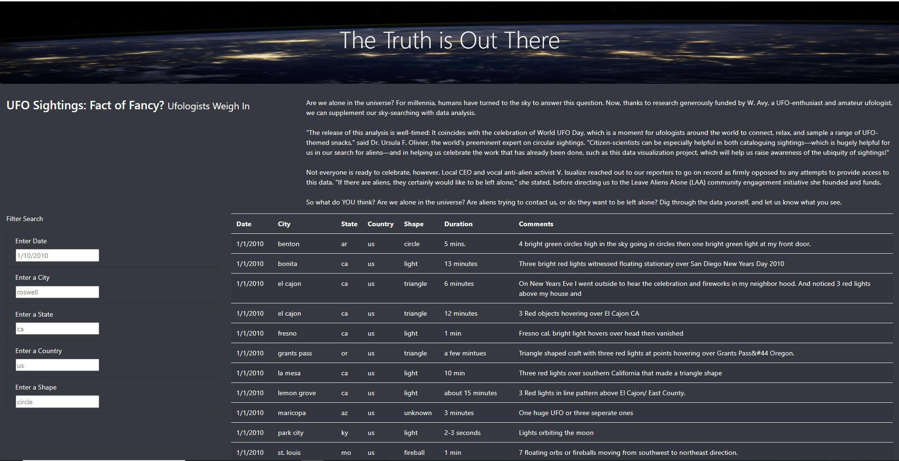
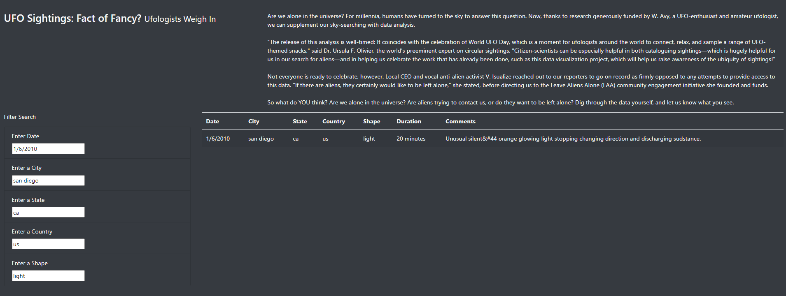

# UFO Sightings Analysis  
Analysis Using JavaScript and HTML 

## Overview of the UFO Sightings Analysis

This project was based on using JavaScript to create an html file that will read the UFO sightings information into a table. To make it easier for users we created filters that allow the user to filter the information by: date, city, state, country, and by shape of the UFO.

## UFO Sightings Results

Use the Filter Search section to enter the date, city, state, country, and shape you wish to filter by. The UFO Sightings table will automatically filter.

### 1. Overview of the HTML file page: 
#### Contains filter boxes on the left side, and the data table on the right. 

### 2. How to filter for information: 
#### Type in desired filter information.

For example: 

date: 1/6/2010

city: sam diego

state: ca

country: us

shape: light

Image below is the representation of the filter.  

## Summary

The filter works well if user knows the specific data they are looking for and users must enter the filters correctly, without spelling and capitalization errors.
A dropdown menu can be added to each of the five filters under the Filter Search section to improve the efficiency of the filters. 
To further develop this webpage we could add an interactive sections for users to add sightings on the website and keep the information more up-to-date.
Another recommendation would be to add an image of the sightings if available. This will help to add more interest to the webpage. 